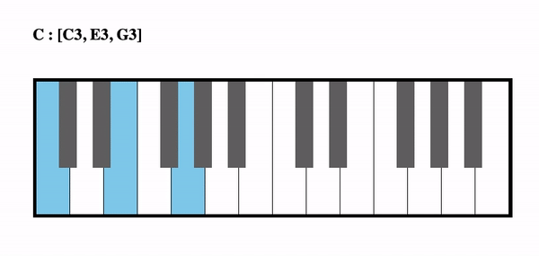
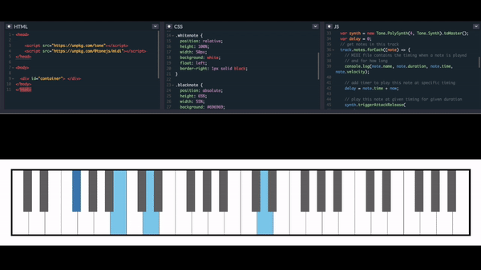

#		COMPUTATIONAL MUSIC

## Generating Music Programmatically

Scripts:

	Piano.html : 	Piano / Synthesizer created in Java Script + HTML using Tone.JS library

	Chords.html : 	Plays & Highlights various Piano Chords

	MIDI-Player.html :

			Takes a MIDI audio file as input, runs MIDI parser to extract musical notes.
			The visualization output shows how to play the tune on Piano / Synthesizer
			by highlighting keys as it plays along the tune.

	Piano-Box.html :

			Musical grid which generates music based on hand gestures..
			Gestures are captured using TensorFlow.JS Hand-Pose model.
			Cells in the grid represent piano keys (white or black),
			and produce corresponding sound (notes) using Tone.JS library.
			Each row represents one octave, a sequence of 7 white and 5 black notes.
